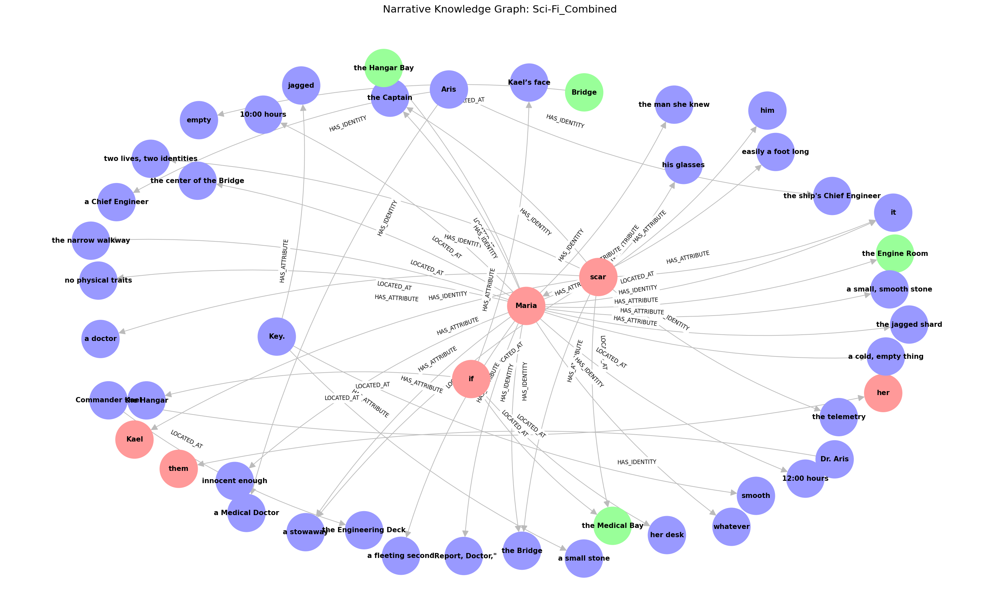

# Benchmark Report

## Overall Summary
| System | TPs | FNs | FPs | Recall |
| :--- | :--- | :--- | :--- | :--- |
| Baseline | 46 | 38 | 20 | 54.8% |
| Custom Pipeline | 0 | 12 | 0 | 0.0% |
| Zero-Shot LLM | 4 | 3 | 2 | 57.1% |

---

## Individual Units
### Sci-Fi_Combined
| System | TPs | FNs | FPs | Recall | Reason |
| :--- | :--- | :--- | :--- | :--- | :--- |
| Baseline | 46 | 38 | 20 | 54.8% | The matching focused on key dialogues and visual descriptions that directly related to the character Kael and the Red Onyx Key. Some non-relevant sentences were incorrectly included due to high contextual similarity. |
| Custom Pipeline | 0 | 12 | 0 | 0.0% | The system output is empty, indicating no inconsistencies were detected by the system. However, the ground truth provided multiple inconsistencies that are not identified. |
| Zero-Shot LLM | 4 | 3 | 2 | 57.1% | The system identified some of the conflicts correctly but also included new ones not present in the ground truth and missed a few. |

